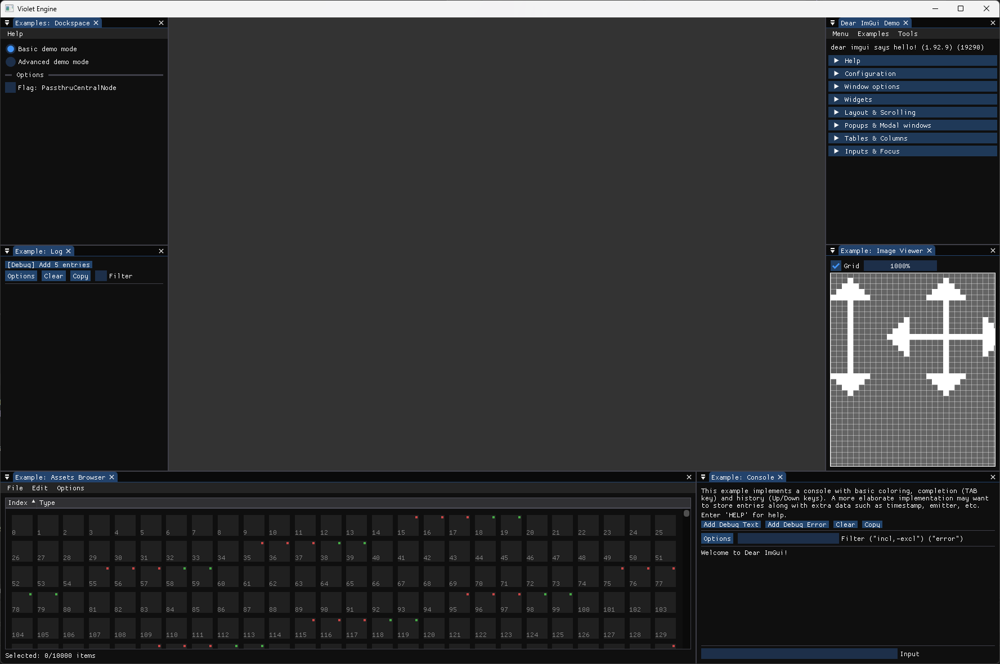

# VIOLET ENGINE

A 3D Graphics Engine written in C++.

## ABOUT

Violet is a real-time rendering engine and personal graphics "toybox" built from the ground up. It serves as a testing ground for experimenting with engine architecture, shaders, and advanced graphics techniques.

This is my first comprehensive engine project, moving beyond isolated graphics demos into a fully structured, multi-platform codebase. The graphics API is currently built on OpenGL, with plans to eventually expand and learn Vulkan.

Why "Violet"? Simple: because I like the color.

## CURRENT STATE



- We got docking!!!!!

---

## Cloning the Repository
This project uses Git submodules for external libraries, so you must clone the repository recursively to pull down the dependencies.

Run this command in your terminal:

```bash
git clone --recursive https://github.com/EnderLove/Violet-Engine.git
```

If you already cloned the project normally and are missing the dependencies, run:

```bash
git submodule update --init --recursive
```
---
## Windows Setup

### Visual Studio
#### Prerequisites: 

* Visual Studio 2022 (with "Desktop development with C++" workload installed).
* *Note: A Premake executable is included in the repository, so you do not need to install it manually.*

#### Build Instructions:

1. Open the project folder.
2. Double-click `GeneProjs_vs.bat`. This will use Premake to generate the Visual Studio solution files.
3. Open `Violet.sln` in Visual Studio.
4. In the Solution Explorer, right-click the **Sandbox** project and select **Set as Startup Project**.
5. Press `F5` or click the **Local Windows Debugger** button at the top to compile and run.

### MSYS2 / MinGW (General Compiler)

#### Prerequisites:
* The project uses standard C++ and should work on most modern compilers, but it is officially tested using the MSYS2 UCRT64 environment.
* *Note: A Premake executable is included in the repository, so you do not need to install it manually.*

#### MSYS2 Setup:
1. Install [MSYS2](https://www.msys2.org/) and launch the **MSYS2 UCRT64** terminal from your Start menu.
2. Run the following command to install the compiler and Make:
   ```bash
   pacman -S mingw-w64-ucrt-x86_64-gcc make
   ```

#### Build Instructions:

1. Open the project folder.
2. Double-click GeneProjs_make.bat. This will use Premake to generate the required Makefiles.
3. Open your terminal in the project folder and run:
``` bash
make
```
4. Once compilation finishes, the executable will be located inside the bin/ directory.

---
### Linux Setup (NOT CURRENTLY AVAILABLE)
Prerequisites: * make, gcc/clang, and standard build essentials installed on your system.

You may also need the Premake5 binary installed globally depending on your setup.

### Build Instructions:

- Open your terminal in the project root.

- The first time you pull the project, you need to grant execution permissions to the generation script:

```bash
chmod +x generate.sh
```
Run the script to generate the Linux Makefiles:
```bash
./generate.sh
```
Compile the engine and client application:
```bash
make
```
Run the app:
```bash
./bin/Debug-linux-x64/Sandbox/Sandbox
```
---

## Features

Even though Violet is in its early stages, it currently features some foundation:
* **Custom Build System:** Fully cross-platform project generation using Premake5 (Windows/Linux).
* **Core Logging System:** Asynchronous, thread-safe, and colored console logging powered by `spdlog`.
* **Dynamic Architecture:** Configured to compile as a dynamic shared library (`.dll` / `.so`) with a decoupled client Sandbox application.